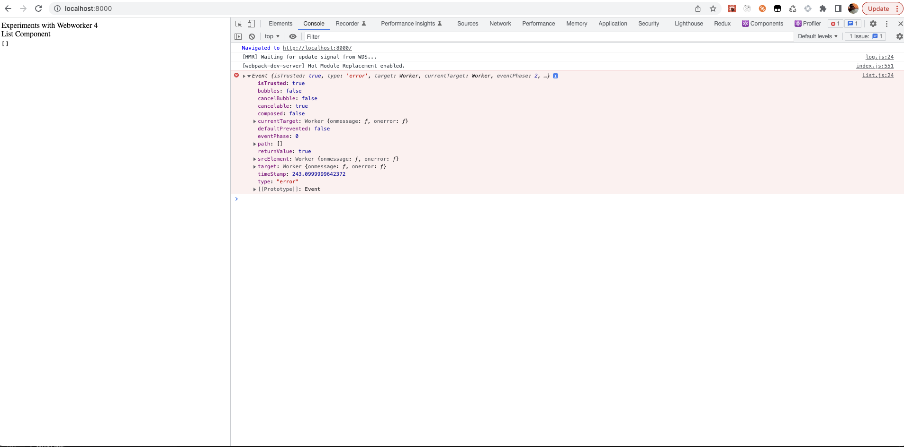
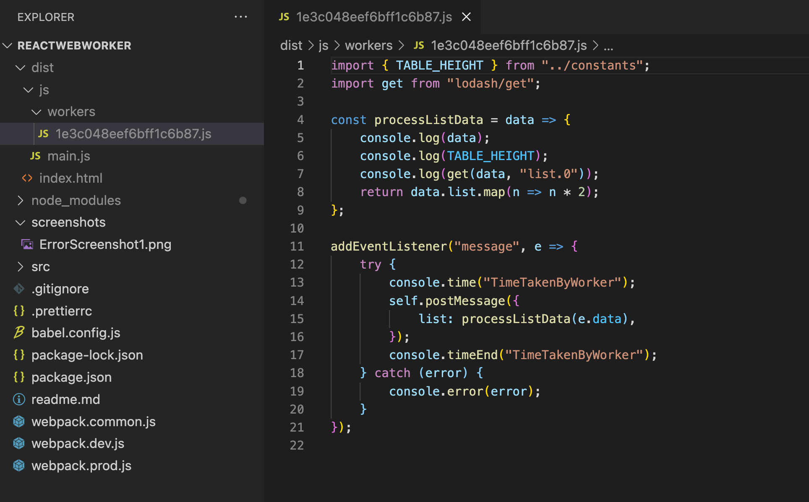
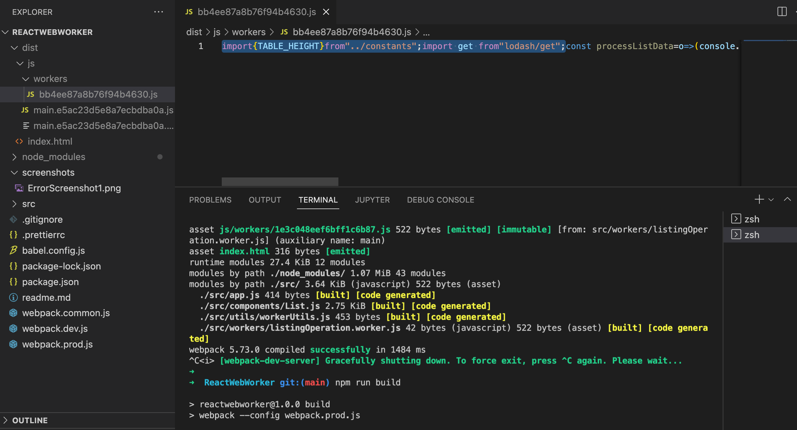

# Module WebWorker in a React App bundled with Webpack-5
This repo is to reproduce an issue with module web worker bundled using webpack-5

## Development

### Prerequisites
Node 14.x and npm 7.x should be avialble on your local setup to run this app locally.

### Steps For Dev mode
```bash
npm ci
npm start
```

### Steps for Prod mode
```bash
npm run build
```

## Issues
- After `npm start` or `npm run build`, notice the worker bundle file in `dist/js/workers` folder. `import` statements are present as it is in the bundle, because of which browser is not able to run it.

### Screenshot of the error

### Dev mode Bundle

### Prod mode Bundle


This issue is being tracked [here](https://github.com/webpack/webpack/issues/15165)